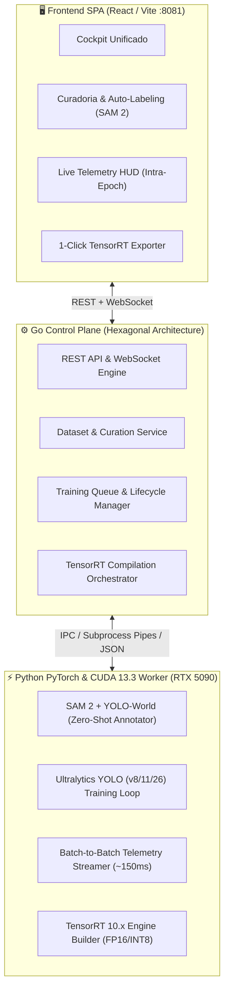

# ⚡ HydraForge — Arquitetura de Referência e Diretrizes Canônicas (2026)

> **Cockpit Unificado de Curadoria de Dados, Treinamento de IA (YOLOv8/11/26) e Compilação TensorRT 10.x**  
> Validado e calibrado através de 3 ciclos de triangulação com a biblioteca técnica do **ReductorPrompt**.

---

## 📏 1. Limites Estritos de Linhas por Arquivo (Zero Monólitos & SRP)

Em total conformidade com os princípios de **Clean Architecture** e **C++ Core Guidelines (I.30)**:

| Tipo de Arquivo / Camada | Limite Máximo | Regra de Decomposição |
| :--- | :---: | :--- |
| **Controladores & Handlers (Go / Python / TS)** | **180 linhas** | Decompor rotas, DTOs e validações em submódulos dedicados (`routes/`, `dtos/`, `handlers/`). |
| **Módulos de Domínio & Entidades (`.go`, `.py`, `.ts`)** | **200 linhas** | Isolar regras de negócio puras sem acoplamento a frameworks ou drivers externos. |
| **Componentes de UI Frontend (`.tsx`, `.vue`)** | **180 linhas** | Quebrar telas complexas em micro-componentes reutilizáveis (`MetricsCard`, `EpochBar`, `DatasetGrid`). |
| **Workers de IA e Scripts CUDA (`.py`)** | **200 linhas** | Separar loop de treino, exportador TensorRT e streaming de telemetria em módulos focados. |

---

## 🎨 2. Design System: As 3 Fontes e as 3 Cores do Sistema

### 🔤 As 3 Fontes Tipográficas Oficiais

```css
:root {
  --font-display: 'Space Grotesk', -apple-system, sans-serif; /* Títulos, Branding, HUD Headers */
  --font-body:    'Outfit', -apple-system, sans-serif;        /* Interface, Formulários, Labels */
  --font-mono:    'JetBrains Mono', monospace;                /* Telemetria, Coordenadas, Logs */
}
```

1. **`Space Grotesk` (Display & Headers)**: Tipografia geométrica, moderna e imersiva para títulos de seções, contadores principais e branding.
2. **`Outfit` (Body & UI)**: Excelente legibilidade em densidades de tela modernas para inputs, tabelas e menus.
3. **`JetBrains Mono` (Data & Telemetry)**: Fonte monoespaçada com ligaduras para métricas de hardware (GPU Temp, VRAM, Loss, FPS) e coordenadas de bounding boxes.

---

### 🎨 As 3 Cores Primárias do Sistema (Paleta Cyber-Industrial)

| Token CSS | Hex Code | Função Semântica |
| :--- | :---: | :--- |
| `--color-cyber-cyan` | `#00F0FF` | **Cor Primária & Foco**: Ações principais, badges ativas, WebSockets conectados, bounding boxes válidas. |
| `--color-forge-amber` | `#FF9900` | **Cor de Destaque & Treino**: Estado de treinamento ativo, compilação TensorRT, avisos e gráficos de Loss. |
| `--color-obsidian` | `#0A0E17` | **Superfície & Background**: Fundo escuro imersivo, cards translúcidos (glassmorphism) e contraste visual premium. |

---

## 🏛️ 3. Arquitetura Hexagonal do HydraForge



---

## 🔄 4. Módulos Funcionais Unificados

### 1️⃣ Módulo de Curadoria & Datasets (Antigo Vault integrado)
- **Inbox & Deduplicação**: Recebe lotes de frames de câmeras e deduplica com hashing perceptual.
- **Auto-Anotação Zero-Shot**: Integração com **SAM 2** e **YOLO-World** para auto-gerar máscaras e bounding boxes.
- **Exportação Canônica**: Gera automaticamente `data.yaml` e pastas `images/` e `labels/` (train/val/test).

### 2️⃣ Módulo de Treino & Telemetria Intra-Epoch
- **Assincronismo GPU-CPU**: Aplicação do padrão documentado no *Dive into Deep Learning (D2L)* para desacoplar a fila de treino da telemetria.
- **Streaming de Métricas**: Envio via WebSocket a cada 2-5 minibatches de:
  - Progresso da época atual ($0-100\%$) e progresso total da sessão.
  - Throughput de treino ($FPS$), $Loss$, $mAP_{50-95}$ e consumo de VRAM na RTX 5090.
- **Controle de Ciclo de Vida**: Ações instantâneas de **PAUSE**, **RESUME**, **ABORT** e **CHECKPOINT**.

### 3️⃣ Módulo de Compilação TensorRT 10.x
- Converte checkpoints `.pt` em motores ultra-otimizados `.engine` com calibração FP16/INT8 para entrega direta ao **HydraStream** e **HydraVMS**.
